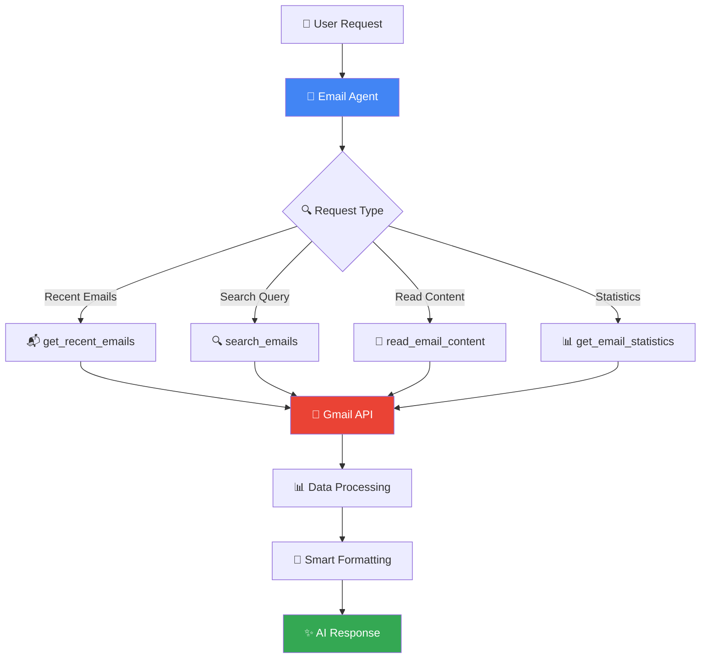

# 📧 Withkm AI Email Agent

<div align="center">

```ascii
██╗    ██╗██╗████████╗██╗  ██╗██╗  ██╗███╗   ███╗
██║    ██║██║╚══██╔══╝██║  ██║██║ ██╔╝████╗ ████║
██║ █╗ ██║██║   ██║   ███████║█████╔╝ ██╔████╔██║
██║███╗██║██║   ██║   ██╔══██║██╔═██╗ ██║╚██╔╝██║
╚███╔███╔╝██║   ██║   ██║  ██║██║  ██╗██║ ╚═╝ ██║
 ╚══╝╚══╝ ╚═╝   ╚═╝   ╚═╝  ╚═╝╚═╝  ╚═╝╚═╝     ╚═╝
```

**Advanced Email Management AI Agent 🤖**

*Powered by Google's Gemini 2.0 Flash ⚡ & Gmail API 📬*

[](https://python.org)
[](https://github.com/google/adk)
[](https://developers.google.com/gmail/api)
[](LICENSE)
[]()

</div>

---

## 🌟 What is Withkm AI Email Agent?

Meet your **intelligent email companion** - a sophisticated AI agent that revolutionizes how you manage, analyze, and interact with your Gmail inbox! This isn't just another email tool; it's your personal email intelligence system designed to:

- 📬 **Smart Email Retrieval** - Instantly access recent, unread, and filtered emails
- 🔍 **Advanced Search** - Find emails using natural language and Gmail's powerful search syntax
- 📊 **Email Analytics** - Get insights and statistics about your email patterns
- 🤖 **AI-Powered Analysis** - Understand email content with intelligent summaries
- 🔒 **Secure Integration** - OAuth 2.0 authentication with Gmail API

## ✨ Core Features

### 📧 **Email Management**
- **Recent Emails** - Get your latest emails with smart previews
- **Unread Monitoring** - Track and manage unread messages efficiently
- **Content Reading** - Access full email content with proper formatting
- **Thread Management** - Navigate email conversations seamlessly

### 🔍 **Advanced Search & Filtering**
- **Natural Language Search** - "Find emails from John about meetings"
- **Gmail Query Support** - Full Gmail search syntax compatibility
- **Date Range Filtering** - Search emails within specific time periods
- **Sender-Based Filtering** - Quickly find emails from specific contacts
- **Subject Line Search** - Locate emails by subject keywords

### 📊 **Intelligence & Analytics**
- **Email Statistics** - Unread count, total emails, label insights
- **Smart Categorization** - Organize emails by importance and context
- **Pattern Recognition** - Identify email trends and behaviors
- **Business Context** - Special handling for Withkm-related communications

## 🚀 Quick Start Guide

### Prerequisites
```bash
✅ Python 3.12+
✅ Google Cloud Account
✅ Gmail Account
✅ Virtual Environment (recommended)
```

### 🛠️ Installation

1. **Clone the repository**
   ```bash
   git clone <your-repo-url>
   cd withkm-email-agent
   ```

2. **Set up virtual environment**
   ```bash
   python -m venv env
   source env/bin/activate  # On Windows: env\Scripts\activate
   ```

3. **Install dependencies**
   ```bash
   pip install -r requirements.txt
   ```

4. **Gmail API Setup**
   ```bash
   # Run the interactive setup wizard
   python setup_calendar_auth.py
   ```

5. **Configure environment (optional)**
   ```bash
   # Create .env file for additional configurations
   touch .env
   ```

6. **Launch the agent**
   ```bash
   python -c "from agent import root_agent; root_agent.start()"
   ```

## 🔧 Gmail API Configuration

### Step-by-Step Setup

#### 1. Google Cloud Console Setup
```bash
🌐 Visit: https://console.cloud.google.com/
📊 Create new project or select existing
🔌 Enable Gmail API (APIs & Services > Library)
🔑 Create OAuth 2.0 credentials
```

#### 2. OAuth Configuration
```bash
🖥️  Application Type: Desktop Application
📁 Download credentials.json
📍 Place in project root directory
```

#### 3. Authentication Flow
```bash
python setup_calendar_auth.py
```

The setup wizard will:
- ✅ Validate your credentials.json file
- 🌐 Open OAuth flow in your browser
- 🔐 Securely store authentication tokens
- 🧪 Test Gmail API connectivity
- 📊 Display connection status and email statistics

### 🔒 Security Features

- **OAuth 2.0** - Industry-standard secure authentication
- **Token Management** - Automatic token refresh and storage
- **Scope Limitation** - Read-only access to Gmail (`gmail.readonly`)
- **Local Storage** - Credentials stored locally in `~/.credentials/`

## 🏗️ Architecture & Design



## 📁 Project Structure

```
withkm-email-agent/
├── 🤖 agent.py                    # Main agent configuration & tools
├── 📝 prompts.py                  # AI instructions & personality
├── 🛠️ tools.py                    # Gmail API integration functions
├── 🔧 setup_calendar_auth.py      # OAuth setup wizard
├── 📦 __init__.py                 # Package initialization
├── 📋 requirements.txt            # Python dependencies
├── 🚫 .gitignore                 # Git ignore rules
└── 📖 README.md                  # Documentation
```

## 🛠️ Available Tools & Functions

### 📬 Email Retrieval
```python
get_recent_emails(max_results=10)
# Get latest emails with metadata and snippets

get_unread_emails(max_results=20)
# Retrieve all unread messages

read_email_content(message_id)
# Get full email content including body text
```

### 🔍 Search & Filter
```python
search_emails(query, max_results=50)
# Advanced email search with Gmail syntax

get_emails_from_sender(sender_email, max_results=20)
# Find all emails from specific sender

get_emails_with_subject(keywords, max_results=20)
# Search emails by subject keywords

get_emails_by_date_range(start_date, end_date, max_results=50)
# Filter emails within date range
```

### 📊 Analytics & Management
```python
get_email_statistics()
# Get comprehensive email insights

get_gmail_labels()
# Retrieve all Gmail labels/folders

check_gmail_setup()
# Verify API configuration and connectivity
```

## 🎪 Usage Examples

### 💬 **Basic Email Retrieval**
```python
# Get recent emails
recent = get_recent_emails(5)
print(format_email_summary(recent))

# Output:
# Found 5 emails:
# 
# 1. From: john@example.com
#    Subject: Meeting Tomorrow
#    Date: 2025-06-20 09:30 AM
#    Preview: Hi there! Just confirming our meeting...
```

### 🔍 **Advanced Search**
```python
# Search unread emails
unread = search_emails("is:unread", 10)

# Find emails with attachments
attachments = search_emails("has:attachment", 20)

# Search by sender and subject
important = search_emails("from:boss@company.com subject:urgent")
```

### 📊 **Email Analytics**
```python
stats = get_email_statistics()
print(f"Unread emails: {stats['unread_count']}")
print(f"Total labels: {stats['total_labels']}")
print(f"Last checked: {stats['last_checked']}")
```

## 🤖 AI Agent Capabilities

### 🧠 **Smart Understanding**
The AI agent can interpret natural language requests:
- *"Show me emails from last week about the project"*
- *"Find unread messages from important clients"*
- *"What's my email activity today?"*

### 📝 **Content Summarization**
- **Email Previews** - Intelligent snippets and summaries
- **Bulk Analysis** - Pattern recognition across multiple emails
- **Priority Detection** - Identify urgent or important messages
- **Business Context** - Special handling for work-related emails

### 🔒 **Privacy Protection**
- **Data Security** - Sensitive information summarized, not exposed
- **Access Control** - Read-only permissions for maximum security
- **Local Processing** - Email content processed locally when possible

## 🔧 Configuration Options

### Environment Variables (.env)
```env
# Optional: Enhanced functionality
GOOGLE_API_KEY=your_google_api_key_here
GMAIL_BATCH_SIZE=50
EMAIL_CACHE_DURATION=300

# Agent Configuration
AGENT_MODEL=gemini-2.0-flash
RESPONSE_FORMAT=structured
```

### Agent Customization
```python
# Modify prompts.py for custom behavior
EMAIL_AGENT_INSTRUCTIONS = """
Your custom instructions here...
"""
```

## 🚨 Troubleshooting

### Common Issues & Solutions

#### 🔐 **Authentication Problems**
```bash
# Problem: "Credentials not found"
# Solution: Run setup wizard
python setup_calendar_auth.py

# Problem: "Token expired"
# Solution: Delete token file and re-authenticate
rm ~/.credentials/gmail_token.json
python setup_calendar_auth.py
```

#### 🌐 **API Errors**
```bash
# Problem: "Gmail API not enabled"
# Solution: Enable in Google Cloud Console
1. Visit Google Cloud Console
2. APIs & Services > Library
3. Search "Gmail API" > Enable

# Problem: "Quota exceeded"
# Solution: Check API usage limits
Visit: Google Cloud Console > APIs & Services > Quotas
```

#### 🔧 **Setup Issues**
```bash
# Problem: "Invalid credentials type"
# Solution: Use Desktop Application credentials
1. Google Cloud Console > Credentials
2. Create OAuth 2.0 Client ID
3. Choose "Desktop Application"
4. Download as credentials.json
```

## 📊 Performance & Limits

### Gmail API Quotas
- **Daily Requests**: 1 billion per day
- **Per User Rate Limit**: 250 quota units per user per 100 seconds
- **Batch Requests**: Up to 100 requests per batch

### Optimization Features
- **Efficient Queries** - Optimized Gmail search patterns
- **Batch Processing** - Group multiple requests when possible
- **Smart Caching** - Reduce redundant API calls
- **Error Handling** - Graceful degradation on rate limits

## 🤝 Connect with Withkm

Ready to supercharge your email workflow? Our AI agent is just the beginning!

- 📧 **Email**: hello@withkm.com
- 🌐 **Website**: [withkm.com](https://withkm.com)
- 💼 **Services**: Custom AI Solutions, Email Automation, System Integration
- 🔧 **Support**: Technical assistance and custom implementations

## 🛡️ Security & Best Practices

### 🔒 **Security Measures**
- ✅ OAuth 2.0 authentication with refresh tokens
- ✅ Read-only Gmail access (no modification capabilities)
- ✅ Local credential storage with proper permissions
- ✅ Encrypted API communications (HTTPS)
- ✅ No email content stored permanently

### 📋 **Best Practices**
- ✅ Regular token refresh and validation
- ✅ Proper error handling and logging
- ✅ Efficient API usage to respect quotas
- ✅ Clean separation of concerns in code architecture
- ✅ Comprehensive testing and validation

## 🔮 Future Enhancements

### Planned Features
- [ ] **Advanced AI Analysis** - Sentiment analysis and content classification
- [ ] **Email Automation** - Smart responses and actions
- [ ] **Calendar Integration** - Link emails with calendar events
- [ ] **Multi-Account Support** - Manage multiple Gmail accounts
- [ ] **Custom Filters** - Advanced filtering and categorization
- [ ] **Notification System** - Real-time email alerts
- [ ] **Export Capabilities** - Email data export and reporting

### Integration Roadmap
- [ ] **Slack Integration** - Email notifications in Slack
- [ ] **CRM Connectivity** - Sync with customer management systems
- [ ] **Task Management** - Convert emails to actionable tasks
- [ ] **Document Processing** - Extract and process email attachments

## 📄 Dependencies

| Package | Version | Purpose |
|---------|---------|---------|
| google-adk[database] | 0.3.0 | Google AI Development Kit with database support |
| google-generativeai | 0.8.5 | Gemini AI models integration |
| google-auth-oauthlib | latest | OAuth 2.0 authentication flow |
| google-api-python-client | latest | Gmail API client library |
| litellm | 1.66.3 | Large Language Model integration |
| python-dotenv | 1.1.0 | Environment variable management |
| psutil | 5.9.5 | System monitoring and performance |
| yfinance | 0.2.56 | Financial data integration (optional) |

## 🎯 Contributing

We welcome contributions to make this email agent even more powerful!

### How to Contribute
1. **Fork** the repository
2. **Create** your feature branch (`git checkout -b feature/AmazingEmailFeature`)
3. **Commit** your changes (`git commit -m 'Add some AmazingEmailFeature'`)
4. **Push** to the branch (`git push origin feature/AmazingEmailFeature`)
5. **Open** a Pull Request

### Development Guidelines
- Follow PEP 8 Python style guidelines
- Add comprehensive docstrings to new functions
- Include unit tests for new features
- Update documentation for any API changes
- Ensure Gmail API best practices are followed

## 📜 License

This project is licensed under the MIT License - see the [LICENSE](LICENSE) file for details.

---

<div align="center">

**Built with ❤️ by the Withkm Team**

*Transforming email management through intelligent automation, one message at a time.*

**[🚀 Get Started](#-quick-start-guide) | [📧 Contact Us](mailto:hello@withkm.com) | [🌐 Visit Withkm](https://withkm.com)**

</div>